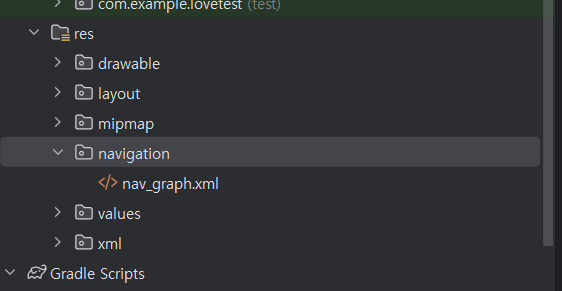
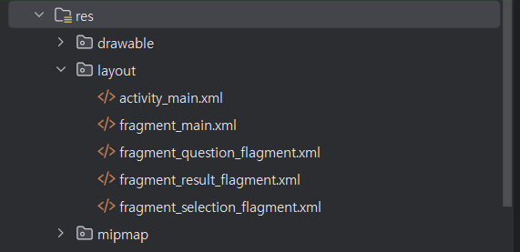
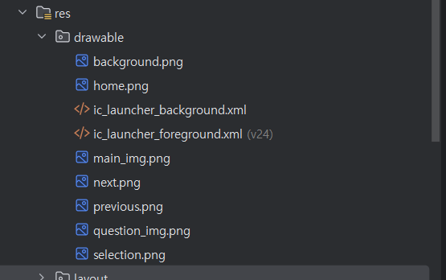
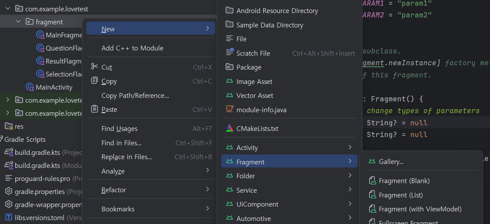
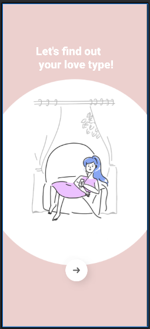
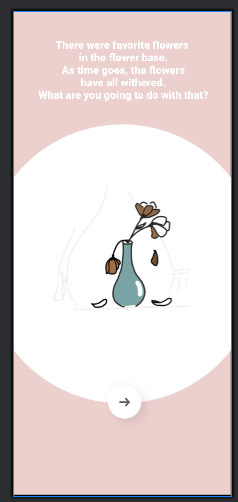
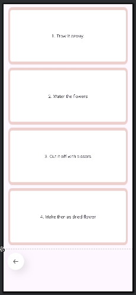
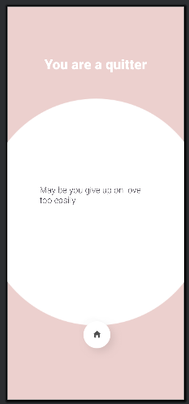
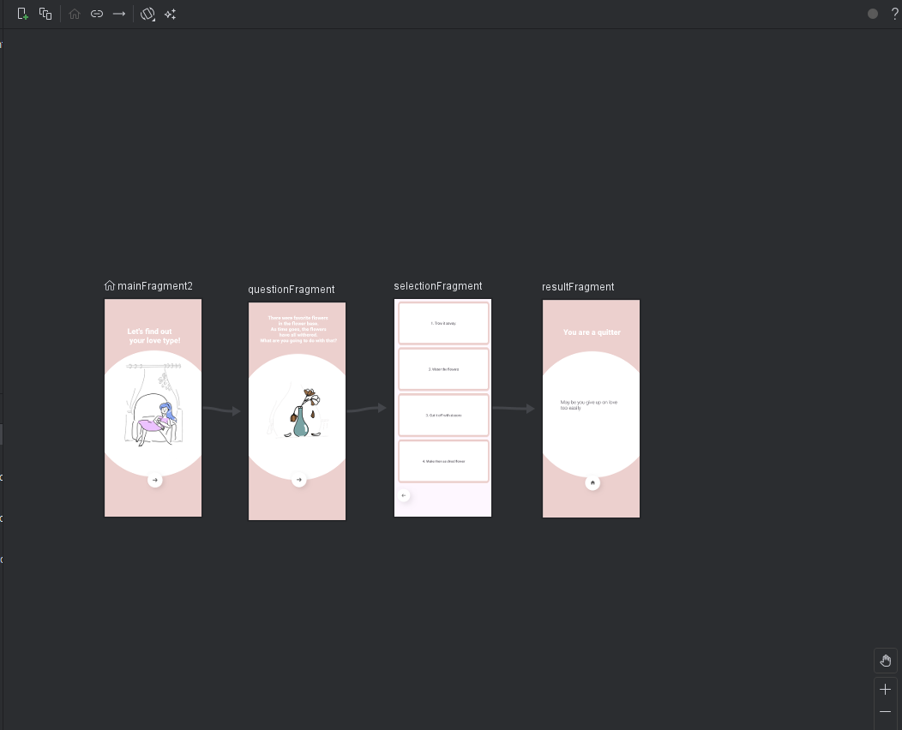

# 코틀린 심리테스트 앱 만들기 Section. 03

## 레이아웃 만들기

### gradle dependencies 추가 (navigation)

```kotlin
val nav_version = "2.8.4"

// Jetpack Compose integration
implementation("androidx.navigation:navigation-compose:$nav_version")

// Views/Fragments integration
implementation("androidx.navigation:navigation-fragment:$nav_version")
implementation("androidx.navigation:navigation-ui:$nav_version")

// Feature module support for Fragments
implementation("androidx.navigation:navigation-dynamic-features-fragment:$nav_version")

// Testing Navigation
androidTestImplementation("androidx.navigation:navigation-testing:$nav_version")
```

- 필요한 lib 만 추가하면 될 거 같다.
- 추가했다면 build 작업

### navigation 패키지



- res 에 Android Resource Directory 생성 (resource type : navigation) -> Navigation resource file 생성

### layout 생성



- 디렉토리 layout 생성 후 main,question,result,section xml 생성

### drawable



- 필요 이미지 drawable 에 추가

### Fragment 추가 (Fragment blank)



- Question,Result,Selector fragment 추가

### mainFragment



```xml
<?xml version="1.0" encoding="utf-8"?>
<androidx.constraintlayout.widget.ConstraintLayout xmlns:android="http://schemas.android.com/apk/res/android"
    xmlns:app="http://schemas.android.com/apk/res-auto"
    xmlns:tools="http://schemas.android.com/tools"
    android:layout_width="match_parent"
    android:layout_height="match_parent"
    android:background="@drawable/background"
    tools:context=".fragment.MainFragment">

    <TextView
        android:layout_width="wrap_content"
        android:layout_height="wrap_content"
        android:layout_marginTop="112dp"
        android:fontFamily="sans-serif-black"
        android:text="@string/maint_title"
        android:textColor="@color/white"
        android:textSize="32dp"
        app:layout_constraintEnd_toEndOf="parent"
        app:layout_constraintStart_toStartOf="parent"
        app:layout_constraintTop_toTopOf="parent"/>

    <ImageView
        android:id="@+id/imageView"
        android:layout_width="260dp"
        android:layout_height="400dp"
        android:src="@drawable/main_img"
        app:layout_constraintEnd_toEndOf="parent"
        app:layout_constraintHorizontal_bias="0.495"
        app:layout_constraintStart_toStartOf="parent"
        tools:ignore="MissingConstraints"
        tools:layout_editor_absoluteY="268dp" />

    <ImageView
        android:layout_width="100dp"
        android:layout_height="100dp"
        android:layout_marginTop="44dp"
        android:src="@drawable/next"
        app:layout_constraintEnd_toEndOf="parent"
        app:layout_constraintHorizontal_bias="0.54"
        app:layout_constraintStart_toStartOf="parent"
        app:layout_constraintTop_toBottomOf="@+id/imageView" />

</androidx.constraintlayout.widget.ConstraintLayout>
```

### questionFragment



```xml
<?xml version="1.0" encoding="utf-8"?>
<androidx.constraintlayout.widget.ConstraintLayout xmlns:android="http://schemas.android.com/apk/res/android"
    xmlns:app="http://schemas.android.com/apk/res-auto"
    xmlns:tools="http://schemas.android.com/tools"
    android:layout_width="match_parent"
    android:layout_height="match_parent"
    android:background="@drawable/background"
    tools:context=".fragment.QuestionFragment">

    <TextView
        android:layout_width="wrap_content"
        android:layout_height="wrap_content"
        android:layout_marginTop="50dp"
        android:fontFamily="sans-serif-black"
        android:text="@string/question"
        android:textColor="@color/white"
        android:textSize="20dp"
        android:gravity="center"
        app:layout_constraintEnd_toEndOf="parent"
        app:layout_constraintStart_toStartOf="parent"
        app:layout_constraintTop_toTopOf="parent"/>

    <ImageView
        android:id="@+id/imageView"
        android:layout_width="260dp"
        android:layout_height="360dp"
        android:src="@drawable/question_img"
        app:layout_constraintEnd_toEndOf="parent"
        app:layout_constraintHorizontal_bias="0.495"
        app:layout_constraintStart_toStartOf="parent"
        tools:ignore="MissingConstraints"
        tools:layout_editor_absoluteY="268dp" />

    <ImageView
        android:layout_width="100dp"
        android:layout_height="100dp"
        android:layout_marginTop="68dp"
        android:src="@drawable/next"
        app:layout_constraintEnd_toEndOf="parent"
        app:layout_constraintHorizontal_bias="0.54"
        app:layout_constraintStart_toStartOf="parent"
        app:layout_constraintTop_toBottomOf="@+id/imageView" />

</androidx.constraintlayout.widget.ConstraintLayout>
```

### selectionFragment



```xml
<?xml version="1.0" encoding="utf-8"?>
<androidx.constraintlayout.widget.ConstraintLayout xmlns:android="http://schemas.android.com/apk/res/android"
    xmlns:app="http://schemas.android.com/apk/res-auto"
    xmlns:tools="http://schemas.android.com/tools"
    android:layout_width="match_parent"
    android:layout_height="match_parent"
    tools:context=".fragment.SelectionFragment">

    <LinearLayout
        android:layout_width="match_parent"
        android:layout_height="0dp"
        android:orientation="vertical"
        android:weightSum="4"
        android:paddingStart="15dp"
        android:paddingEnd="15dp"
        app:layout_constraintBottom_toTopOf="@+id/guideline2"
        app:layout_constraintTop_toTopOf="parent">

        <TextView
            android:id="@+id/option_1"
            android:layout_width="match_parent"
            android:layout_height="0dp"
            android:layout_weight="1"
            android:gravity="center"
            android:text="1. Trow it asway."
            android:background="@drawable/selection"
            android:layout_marginBottom="10dp"
            android:layout_marginTop="10dp"/>
        <TextView
            android:id="@+id/option_2"
            android:layout_width="match_parent"
            android:layout_height="0dp"
            android:layout_weight="1"
            android:gravity="center"
            android:text="2. Water the flowers"
            android:background="@drawable/selection"
            android:layout_marginBottom="10dp"/>
        <TextView
            android:id="@+id/option_3"
            android:layout_width="match_parent"
            android:layout_height="0dp"
            android:layout_weight="1"
            android:gravity="center"
            android:text="3. Cut it off with sissors"
            android:background="@drawable/selection"
            android:layout_marginBottom="10dp"/>
        <TextView
            android:id="@+id/option_4"
            android:layout_width="match_parent"
            android:layout_height="0dp"
            android:layout_weight="1"
            android:gravity="center"
            android:text="4. Make then as dried flower"
            android:background="@drawable/selection"
            android:layout_marginBottom="10dp"/>

    </LinearLayout>

    <ImageView
        android:id="@+id/btn_back"
        android:layout_width="100dp"
        android:layout_height="100dp"
        android:src="@drawable/previous"
        app:layout_constraintTop_toBottomOf="@id/guideline2"
        app:layout_constraintStart_toStartOf="parent"/>

    <androidx.constraintlayout.widget.Guideline
        android:id="@+id/guideline2"
        android:layout_width="wrap_content"
        android:layout_height="wrap_content"
        android:orientation="horizontal"
        app:layout_constraintGuide_percent="0.85" />
    
</androidx.constraintlayout.widget.ConstraintLayout>
```

### resultFragment



```xml
<?xml version="1.0" encoding="utf-8"?>
<androidx.constraintlayout.widget.ConstraintLayout xmlns:android="http://schemas.android.com/apk/res/android"
    xmlns:app="http://schemas.android.com/apk/res-auto"
    xmlns:tools="http://schemas.android.com/tools"
    android:layout_width="match_parent"
    android:layout_height="match_parent"
    android:background="@drawable/background"
    tools:context=".fragment.ResultFragment"
    tools:layout_editor_absoluteX="0dp"
    tools:layout_editor_absoluteY="566dp">

    <TextView
        android:id="@+id/textView"
        android:layout_width="wrap_content"
        android:layout_height="wrap_content"
        android:layout_marginTop="112dp"
        android:fontFamily="sans-serif-black"
        android:text="You are a quitter"
        android:textColor="@color/white"
        android:textSize="32dp"
        app:layout_constraintEnd_toEndOf="parent"
        app:layout_constraintStart_toStartOf="parent"
        app:layout_constraintTop_toTopOf="parent" />

    <TextView
        android:id="@+id/imageView"
        android:layout_width="260dp"
        android:layout_height="wrap_content"
        android:fontFamily="sans-serif-light"
        android:text="May be you give up on love too easily"
        android:textSize="20dp"
        app:layout_constraintBottom_toTopOf="@+id/imageView2"
        app:layout_constraintEnd_toEndOf="parent"
        app:layout_constraintHorizontal_bias="0.496"
        app:layout_constraintStart_toStartOf="parent"
        app:layout_constraintTop_toBottomOf="@+id/textView"
        tools:ignore="MissingConstraints" />

    <ImageView
        android:id="@+id/imageView2"
        android:layout_width="100dp"
        android:layout_height="100dp"
        android:src="@drawable/home"
        app:layout_constraintEnd_toEndOf="parent"
        app:layout_constraintHorizontal_bias="0.533"
        app:layout_constraintStart_toStartOf="parent"
        tools:layout_editor_absoluteY="720dp"
        tools:ignore="MissingConstraints" />

</androidx.constraintlayout.widget.ConstraintLayout>
```

### navigation controller (nav_graph.xml)

- 이미지 레이아웃을 만들었다면 해당 네비게이션 순서를 정하는 과정이 있다. 해당 nav_graph.xml 에서 그 역할을 수행 가능하다.
- tools:context=".fragment.ResultFragment" 처럼 context 명을 추가하면 nav_graph 에서 컨트롤이 가능하다.



- 정상적으로 context 를 추가했다면 위의 추가 버튼 클릭 시에 정상적으로 레이아웃들이 뜰것이다.
- 다 추가를 했다면 메인으로 둘 레이아웃을 클릭 후 홈버튼을 클릭하면 메인 화면이 된다.
- 그다음 레이아웃끼리 연결 순서를 정해주면 된다.
- 아래는 디자인으로 했을때 나오는 코드값이다.

```xml
<?xml version="1.0" encoding="utf-8"?>
<navigation xmlns:android="http://schemas.android.com/apk/res/android"
    xmlns:app="http://schemas.android.com/apk/res-auto"
    xmlns:tools="http://schemas.android.com/tools"
    android:id="@+id/nav_graph"
    app:startDestination="@id/mainFragment2">
    <fragment
        android:id="@+id/mainFragment2"
        android:name="com.example.lovetest.fragment.MainFragment"
        android:label="fragment_main"
        tools:layout="@layout/fragment_main" >
        <action
            android:id="@+id/action_mainFragment2_to_questionFragment"
            app:destination="@id/questionFragment" />
    </fragment>
    <fragment
        android:id="@+id/questionFragment"
        android:name="com.example.lovetest.fragment.QuestionFragment"
        android:label="fragment_question_flagment"
        tools:layout="@layout/fragment_question_flagment" >
        <action
            android:id="@+id/action_questionFragment_to_selectionFragment"
            app:destination="@id/selectionFragment" />
    </fragment>
    <fragment
        android:id="@+id/selectionFragment"
        android:name="com.example.lovetest.fragment.SelectionFragment"
        android:label="fragment_selection_flagment"
        tools:layout="@layout/fragment_selection_flagment" >
        <action
            android:id="@+id/action_selectionFragment_to_resultFragment"
            app:destination="@id/resultFragment" />
    </fragment>
    <fragment
        android:id="@+id/resultFragment"
        android:name="com.example.lovetest.fragment.ResultFragment"
        android:label="fragment_result_flagment"
        tools:layout="@layout/fragment_result_flagment" />
</navigation>
```

### mainController

- navController 선언
- lateinit : 나중에 사용하겠다.

```kotlin
class MainActivity : AppCompatActivity() {

    private lateinit var navController: NavController

    override fun onCreate(savedInstanceState: Bundle?) {
        super.onCreate(savedInstanceState)
        enableEdgeToEdge()
        setContentView(R.layout.activity_main)
        ViewCompat.setOnApplyWindowInsetsListener(findViewById(R.id.main)) { v, insets ->
            val systemBars = insets.getInsets(WindowInsetsCompat.Type.systemBars())
            v.setPadding(systemBars.left, systemBars.top, systemBars.right, systemBars.bottom)
            insets
        }

        val navHostFragment = supportFragmentManager.findFragmentById(R.id.nav_host_fragment)
                as? NavHostFragment ?: throw IllegalStateException("NavHostFragment not found")
        navController = navHostFragment.navController
    }
}
```

- 해당 main 에 navHostFragment 를 추가하려면 activity_main.xml 에 해당 id 값 일치 여부 확인 또는 추가

```xml
    <androidx.fragment.app.FragmentContainerView
        android:layout_width="match_parent"
        android:layout_height="match_parent"
        android:id="@+id/nav_host_fragment"
        android:name="androidx.navigation.fragment.NavHostFragment"
        app:navGraph="@navigation/nav_graph"
        app:defaultNavHost="true" />
```

### button 을 통한 페이지 이동

- 주고 싶은 해당 fragment 에 onclick 이벤트 추가
- 뭔가 javascript 랑 비슷한 형태인 것 같다. -> 아이디 값 찾고 onclick 이벤트 추가 형식이 비슷
- 해당 버튼 레이아웃에도 id 값 추가

```kotlin
private lateinit var navController: NavController

override fun onViewCreated(view: View, savedInstanceState: Bundle?) {
    super.onViewCreated(view, savedInstanceState)

    navController = Navigation.findNavController(view)

    val btnNext: ImageView = view.findViewById(R.id.btn_next)

    btnNext.setOnClickListener {
        navController.navigate(R.id.action_mainFragment2_to_questionFragment)
    }
}
```

#### 상속 활용

- 아래의 코드 처럼 View.onClickListener 함수를 가져와 상속을 부여한다.
- 아무래도 상속을 받고 onclick 에 대한 이벤트를 공통으로 처리를 하는게 더 가독성도 좋고 유지보수에 쉬울 거 같다.

```kotlin
class QuestionFragment : Fragment(), View.OnClickListener {
    private lateinit var navController: NavController

    override fun onViewCreated(view: View, savedInstanceState: Bundle?) {
        super.onViewCreated(view, savedInstanceState)

        navController = Navigation.findNavController(view)

        val btnNext: ImageView = view.findViewById(R.id.btn_next)

        btnNext.setOnClickListener (this)
    }

    override fun onClick(v: View?) {
        when(v?.id) {
            R.id.btn_next -> {
                navController.navigate(R.id.action_questionFragment_to_selectionFragment)
            }
        }
    }
}
```

### navigation 페이지 이동 때 애니메이션 효과 주기 

```xml
<action
    app:enterAnim="@anim/nav_default_enter_anim"
    app:exitAnim="@anim/nav_default_exit_anim"
    app:popEnterAnim="@anim/nav_default_pop_enter_anim"
    app:popExitAnim="@anim/nav_default_pop_exit_anim" />
```

- 위의 코드와 같이 fragment 에 action(페이지 이동) 효과에 해당 enter,exit,pop 에 대한 효과를 주면 적용 가능

### 버튼 클릭으로 이동 시 버튼에 따른 text 변경

```kotlin
class SelectionFragment : Fragment(), View.OnClickListener {
    private lateinit var navController : NavController

    override fun onViewCreated(view: View, savedInstanceState: Bundle?) {
        super.onViewCreated(view, savedInstanceState)

        navController = Navigation.findNavController(view)

        val btnBack: ImageView = view.findViewById(R.id.btn_back)
        val option_1: TextView = view.findViewById(R.id.option_1)
        val option_2: TextView = view.findViewById(R.id.option_2)
        val option_3: TextView = view.findViewById(R.id.option_3)
        val option_4: TextView = view.findViewById(R.id.option_4)

        btnBack.setOnClickListener(this)
        option_1.setOnClickListener(this)
        option_2.setOnClickListener(this)
        option_3.setOnClickListener(this)
        option_4.setOnClickListener(this)
    }

    // back stack
    override fun onClick(v : View?) {
        when(v?.id) {
            R.id.option_1 -> {navigateWithIndex(1)}
            R.id.option_2 -> {navigateWithIndex(2)}
            R.id.option_3 -> {navigateWithIndex(3)}
            R.id.option_4 -> {navigateWithIndex(4)}
            R.id.btn_back -> {
                navController.popBackStack()
            }
        }
    }

    fun navigateWithIndex(index : Int) {

        val bundle : Bundle = bundleOf("index" to index)
        navController.navigate(R.id.action_selectionFragment_to_resultFragment,bundle)
    }
}
```

- onclick 공통 함수를 만들고 해당 id 값에 따라 적용
- popBackStack() : 기본적으로 app 은 stack 을 쌓아 놓는데 이전 버튼을 클릭 시 해당 이전 stack 을 빼고 리버전으로 돌아간다.
- navigateWithIndex : bundle 에 index 를 담아주고 result 레이아웃으로 bundle 을 보내줌 -> java model 같은 역할인 듯 싶다.

```kotlin
class ResultFragment : Fragment() {

    private var option = -1

    private lateinit var navController: NavController

    override fun onCreateView(
        inflater: LayoutInflater, container: ViewGroup?,
        savedInstanceState: Bundle?
    ): View? {
        // Inflate the layout for this fragment

        option = arguments?.getInt("index")?:-1

        return inflater.inflate(R.layout.fragment_result_flagment, container, false)
    }

    private lateinit var tv_main: TextView
    private lateinit var tv_sub: TextView
    private lateinit var btn_home: ImageView

    override fun onViewCreated(view: View, savedInstanceState: Bundle?) {
        super.onViewCreated(view, savedInstanceState)

        navController = Navigation.findNavController(view)
        tv_main = view.findViewById(R.id.tv_main)
        tv_sub = view.findViewById(R.id.tv_sub)
        btn_home = view.findViewById(R.id.btn_home)

        btn_home.setOnClickListener {
            navController.navigate(R.id.action_resultFragment_to_mainFragment2)
        }

        setResult(option)
    }

    fun setResult(option: Int) {
        when(option) {
            1 -> {
                tv_main.text = "You are a quitter"
                tv_sub.text = "1. Trow it asway."
            }
            2 -> {
                tv_main.text = "You should focus on yourself"
                tv_sub.text = "2. Water the flowers"
            }
            3 -> {
                tv_main.text = "You should take it easy"
                tv_sub.text = "3. Cut it off with sissors"
            }
            4 -> {
                tv_main.text = "You are pretty mature."
                tv_sub.text = "4. Make then as dried flower"
            }
        }
    }
}
```

- option = arguments?.getInt("index")?:-1 -> bundle 보내준 arguments 의 index 를 가져옴
- onViewCreated -> 레이아웃 페이지 이동 시 id 할당, setResult() 함수에 가져온 index 변수를 담아 호출
- setResult -> index 번호에 따라 text 변경

## 마무리

- 기본적인 navigation 역할과 kotlin 동작에 대해서 공부할 수 있는 시간이였다.
- 해당 navigation 을 이해함으로서 앞으로 엡 동작에 간편하게 적용 가능할 거 같다.
- java 를 공부했다면 어떤 역할을 하는지만 알면 접근하기 쉬울 거 같다.