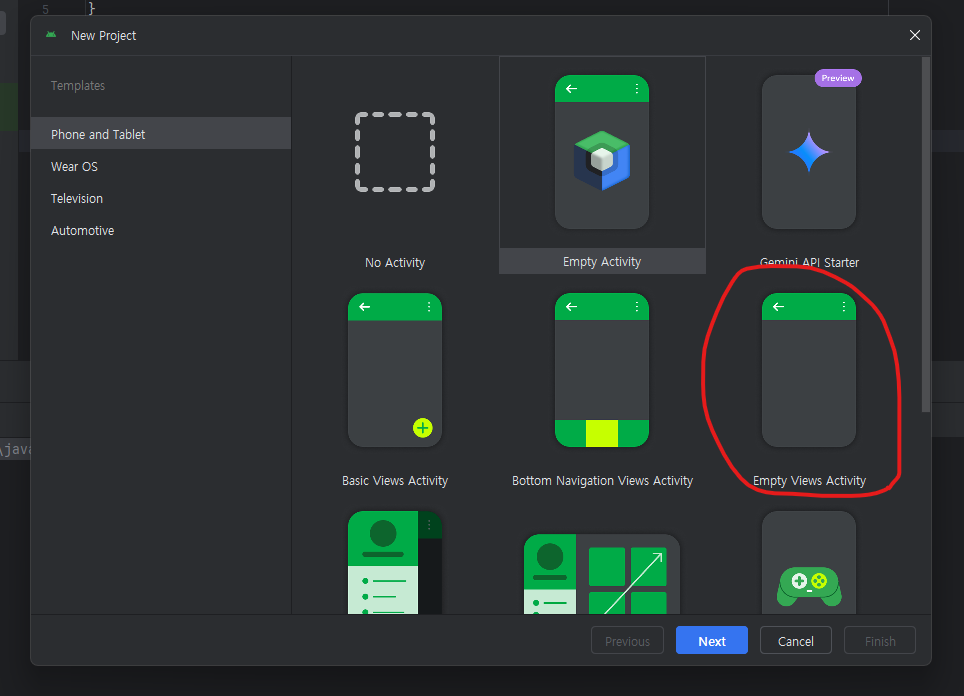

# 코틀린 기본 문법 Section. 01

## Android Studio 다운로드

### 다운로드

[Android Page](https://developer.android.com/studio?gad_source=1&gclid=Cj0KCQiAlsy5BhDeARIsABRc6ZuyPq0W3YwpeQVyYxVGoRdTHGO-_1XY2FXtc6Z7OhhkCk-1d8X5FmkaAirDEALw_wcB&gclsrc=aw.ds&hl=ko)

- 해당 페이지에서 다운로드 시작

### 프로젝트 생성



- empty 파일 생성

## 함수 알아보기

### main

```kotlin
package com.example.kotlinpractice

fun main() {
    helloWorld()
}

```

- 위와 같이 자바와 동일하게 main 메소드 호출을 통해 해당 파일이 실행되는 걸 확인 가능

### helloWorld()

```kotlin
fun helloWorld() : Unit {
    println("Hello World")
}
```

- Unit : 자바와 동일하게 return 형이 아무것도 없을때는 Unit 을 사용 (생략가능)

### 변수 선언

```kotlin
fun add(a : Int, b : Int) : Int {
    return a+b
}
```

- 자바와 다르게 Kotlin 에서는 변수 타입을 뒤에 선언한다.
- 추가적으로 변수 타입명을 첫번째를 대문자로 써야한다.
- Unit 은 자바 void 와 동일한 형태로 return 타입을 생략 가능하다. 하지만 return 이 있다면 위 코드처럼 : Int 와 동일하게 선언을 해줘야한다.

## val vs var

### 불변, 가변

```kotlin
fun hi() {
    val a : Int = 10 // 변하지 않는 상수
    var b : Int = 9 // 변할 수 있는 수

    var e : String

    b = 100

    val c = 100
    var d = 100
    var name : String = "sungho"
}
```

- val : 변하지 않는 상수이다.
- var : 변할 수 있는 타입이다. 선언 후 언제든 재할당이 가능하다.
- 변수 선언 시 선언과 동시에 값을 할당한다면 변수 타입은 생략 가능하다.

## String Template

### ${}

```kotlin
fun main() {
    val name = "sungHo"
    val lastName = "Cho"
    println("my name is $name I'm 23")
    println("my name is ${name + lastName}I'm 23")

    println("is this true? ${1==0}")

    println("this is 2\$a")
}
```
- $뒤에 선언한 변수명을 넣을 시 해당 변수 값이 들어가서 + 연산으로 출력이 되는 걸 확인 가능하다.

```java
String name = "sungHo";
System.out.println("my name is " + name);
```

- 위의 자바 코드와 똑같은 형태라 생각하면 될 거 같다.
- \$ : 실제로 달러를 사용할 때의 예제이다.
- JSTL 을 사용했다면 이해가 빠를 거 같다.

## 조건식

### if 조건

```kotlin
fun maxBy(a : Int, b : Int) : Int {
    if (a > b) {
        return a
    } else {
        return b
    }
}

fun maxBy2(a : Int, b : Int) = if (a>b) a else b
```

- Java 와 동일하게 if 조건을 걸 수 있다.
- 아래의 두번째 케이스를 보면 삼항 연산이 생각 날 것이다. Kotlin 에서는 저런식으로 한번에 처리가 가능하다.
- return (a>b) ? a : b 와 동일

### when() 조건

```kotlin
fun checkNum(score : Int) {
    when(score) {
        0 -> println("this is 0")
        1 -> println("this is 1")
        2,3 -> println("this is 2 or 3")
        else -> println("I don't know")
    }

    var b = when(score) {
        1 -> 1
        2 -> 2
        else -> 3
    }

    println("b : ${b}")

    when(score) {
        in 90..100 -> println("You are genius")
        in 10..80 -> println("not bad")
        else -> println("okay")
    }
}
```

- 자바 switch 문과 동일하게 when(변수) 변수 조건이 x 일 경우 동작시킬 행동을 지정해줄 수 있다.
- var b = when() 처럼 바로 할당도 가능해서 유용할 거 같다.
- in x..y : x~y 사이의 값일 경우

### Expression vs Statement

- 코틀린의 모든 함수는 대부분 Expression 이다. 자바에서는 return 값이 있기에 Statement 메서드로 설정이 된다.
- Expression : 뚝딱뚝딱 값을 만들어내는 과정
- Statement : 명령형으로 이 값을 줄게!!

## Array and List

### Array and List

```kotlin
// Array

// List 1. List 2. MutableList

fun array() {
    /* 초기화 */
    val array = arrayOf(1,2,3)
    val list = listOf(1,2,3)

    val array2 = arrayOf(1,"d",3.4f)
    val list2 = listOf(1,"d",11L)

    array[0] = 3
    var result = list.get(0)

    val arrayList = arrayListOf<Int>() // val 을 쓰는 이유는 해당 주소 자체는 변하지 않는다 arrayList 는 arrayList 를 가르키는거지 list B 를 가르키진 않는다.
    arrayList.add(10)
    arrayList.add(20)

}
```

- Array : 내부의 값을 set 으로 변형이 가능하다.
- list : list 배열 값들은 변형이 불가하고 처음에 선언 한 값을 이용은 가능하다.
- MutableList (arrayListOf) : array 와 동일하게 내부의 값을 새롭게 set 이 가능하고 값을 추가하는 것도 가능하다.
- array<Any> 자바와 다르게 배열 안에 float, String, int 타입 상관 없이 넣을 수 있다.

## 반복문

### for

```kotlin
fun forAndWhile() {

    val students = arrayListOf("joyce","james","jenny","jennifer")

    for (name in students) { // in 연산자를 이용해 반복문
        println("${name}")
    }

    var sum : Int = 0
    for (i in 1..10 step 2) {
        sum += i
    }
    for (i in 10 downTo 1) {
        sum += i
    }
    for (i in 10 until  100) { // 1..100 과 다른점은 100 을 포함 하지 x
        sum += i
    }
    println(sum)
}
```

- x in y : String name : ArrayList<String> nameList 와 동일하다고 생각 하면 될 거 같다.
- x in y..z : 해당 연산자는 for (int i = x; i <= z; i++) 와 동일하게 y <= z 만큼 반복문을 돌리게 된다.
- step : 해당 숫자만큼 건너서 반복을 돌림
- downTo : 반대로 y ~ z 까지 반복
- until : x < z 로 x 부터 z 미만까지 반복을 돌림

### while 반복문

```kotlin
fun forAndWhile() {
    var index = 0
    while (index < 10) {
        println("current index : ${index}")
        index++
    }

}
```

- 자바 while 문과 동일

### withIndex

```kotlin
fun forAndWhile() {
    val students = arrayListOf("joyce","james","jenny","jennifer")
    
    for ((index,name) in students.withIndex()) {
        println("${index + 1}번째 학생 : ${name}")
    }

}
```

- index 와 함께 반복을 돌린다. 즉 students 의 배열의 개수 만큼 n 번째 인덱스 번호와 name 을 추출

## Nullable / NonNull

### ?

```kotlin
fun nullCheck() {
    // NPE : Null pointer Exception
    var name : String = "sungHo"

    var nullName : String? = null // type 생략 불가

    var nameInUpperCase = name.toUpperCase()

    var nullNameInUpperCase = nullName?.toUpperCase()
}
```

- 변수 타입에 ? 를 붙이게 되면 nullAble 로 해당 변수는 null 타입이 가능하다고 선언을 한 것이다.
- 해당 nullAble 로 선언한 순간 toUpperCase 처럼 변수내부의 함수를 호출하려면 ? 조건을 걸어야한다. -> null 이면 그냥 null 로 반환

### ?: 엘비스 연산자

```kotlin
fun nullCheck() {
    // ?: 엘비스 연산자
    var name : String = "sungHo"
    val lastName : String? = null

    val fullName = name + " " + (lastName?: "NO lastName")

    println(fullName)
}
```

- ?: -> 만약에 null 일 경우 default 값을 부여 가능하다.

### !! NOTNULL

```kotlin
fun ignoreNulls(str : String?) {
    val mNotNull : String = str!! // 확실 하게 NonNull 이면 이거를 지향
    val upper = mNotNull.toUpperCase()

    val email : String? = "kidcojsh@gmail.com"
    email?.let{ // null 이 아니면 이거를 해당 람다식을 사용
        println("my email is ${email}")
    }
}
```

- !! : 위의 코드를 보면 변수명에 !! 를 붙이게 되면 NotNull 로 null 일 경우 nullPointerException 을 터트린다. 확실하게 개발자 입장에서 null 이 되면 안된다고 선언할때 유용하게 많이 사용될 것이다.
- ?.let : null 이 아닐 경우 내부의 함수가 실행 된다. if(str != null) 조건과 같은 개념이다.

## Class

### Class 선언

```kotlin
fun main() {
    val human = Human("minsu")
    
    val stranger = Human()
    
    human.eatingCake()

    println("this human's name is ${stranger.name}")
}

class Human (val name : String = "Anonymous") {
    
    init { // 메소드 호출과 동시에 제일 먼저 실행
        println("New human has been born!!")
    }

    fun eatingCake() {
        println("This is so YUMMMYYYYY~~~ ")
    }
}
```

- init : 해당 class 호출과 동시에 제일 먼저 실행되는 부분이다.
- class x (변수) : default 값이 있다면 변수를 할당 안해도 해당 클래스 호출이 가능하다.
- 자바와 동일하게 클래스 선언 후 해당 클래스 내부에 있는 함수를 .fun 으로 호출이 가능하다.

### 생성자

```kotlin
class Human (val name : String = "Anonymous") {

    constructor(name: String, age : Int) : this(name){
        println("my name is 2${name}, ${age} years old")
    }
}

fun main() {
    val stranger = Human()

    val mom = Human("Kuri",52)

    println("this human's name is ${stranger.name}")
}
```

```java
class Preson {
    public Person(String name) {
    }

    public Person(String name, int age) {
        this(name);
    }
}
```

- class (변수) 로 기본 생성자가 가능하지만 아래의 자바 코드 처럼 기본 생성자 제외 하고 kotlin 에서 constructor 를 선언 하는 방법은 위와 같다.
- Human() 이면 (name: String, age : Int) 해당 생성자를 호출 하진 못한다.

### override

```kotlin
open class Human (val name : String = "Anonymous") {

    constructor(name: String, age : Int) : this(name){
        println("my name is 2${name}, ${age} years old")
    }

    init { // 메소드 호출과 동시에 제일 먼저 실행
        println("New human has been born!!")
    }

    fun eatingCake() {
        println("This is so YUMMMYYYYY~~~ ")
    }

    open fun singASong() {
        println("lalala")
    }

}
class Korean : Human() { // extends
    override fun singASong() {
        super.singASong()
        println("라라랄")
        println("my name is : ${name}")
    }
}

fun main() {
    val korean = Korean()
    korean.singASong()
}
```

- kotlin 에서 상속하는 방법은 java 와 동일하게 상속은 한 가지 class 만 가능하다.
- kotlin 에서는 class default 가 final class 이다.
- 상속 받은 클래스에서 부모 클래스의 함수를 사용하고 싶다면 자바에서 public 을 선언해주는거와 동일하게 open 을 해줘야 한다.
- 그리고 override 는 자바에서 배운거와 같이 같은 명의 함수를 재할당 하려면 override 를 붙여서 다시 선언해주고 사용하면 가능하다.

## 마무리

- 현재 자바 개발자로서 아직까지는 자바와 비슷한 개념으로 이해하기 쉬운 부분이 많은 거 같다.
- 자바 보다 훨씬 편의성면에서 뛰어난 거 같다.
- 뭔가 스크립트와 자바가 합쳐진 느낌...?